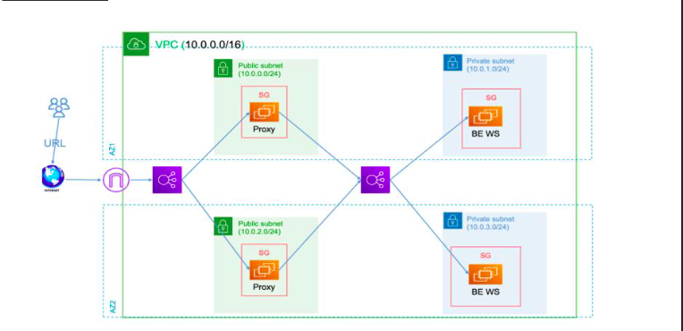
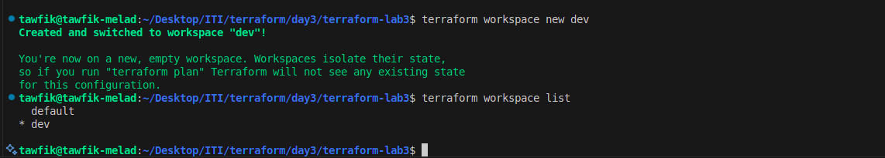
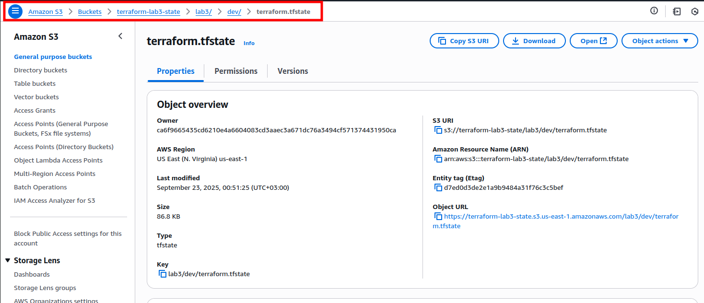
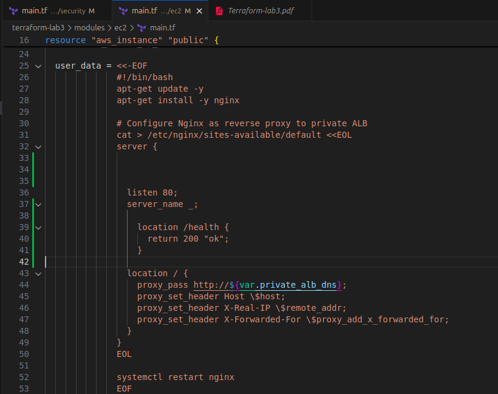
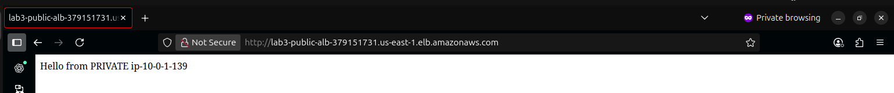

# Terraform Lab 3

## Overview

This project builds a simple AWS infrastructure using Terraform, applying main concepts like remote backend and modules. The architecture is:

Internet → Public ALB → Public EC2s (Nginx Proxy) → Private ALB → Private EC2s



---

## Steps

1. **Create Workspace**
   - Use Terraform workspaces to isolate environments (e.g., dev, prod).
   - 

2. **Remote Backend**
   - Store the Terraform state file in S3 to avoid conflicts in team work.
   - 

3. **Custom Modules**
   - Use custom modules for reusability and clean architecture.

4. **Reverse Proxy**
   - Deploy Nginx as a reverse proxy in public EC2s before requests reach the backend for more security.
   - 

5. **Browser Snapshot**
   - 
   - 


---

## Key Features
- VPC with public/private subnets across AZs
- Nginx reverse proxy setup
- Security groups for isolation
- Remote state management (S3)
- Workspaces for environment separation
- Modular and reusable Terraform code

---

## Usage

```bash
terraform init
terraform workspace new dev
terraform workspace select dev
terraform plan -var-file=envs/dev.tfvars
terraform apply -var-file=envs/dev.tfvars
```

---

## Notes
- Sensitive files (`*.tfstate`, `*.tfvars`) are gitignored.
- Use workspaces to manage multiple environments.
- See `modules/` for reusable Terraform modules.
